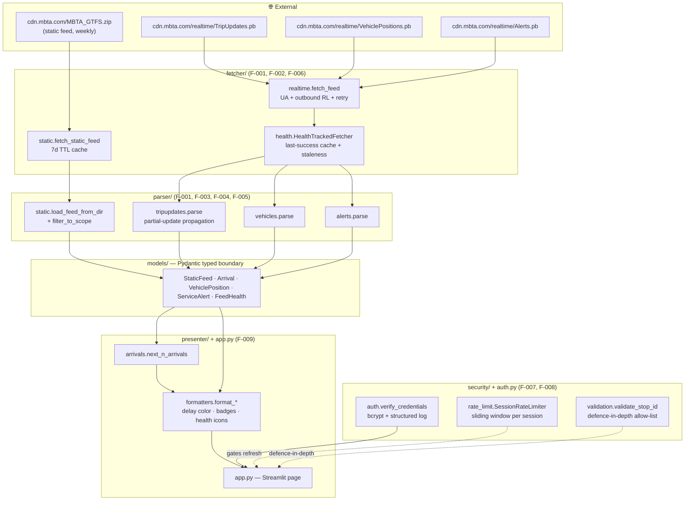

# gtfs-dleung

A focused GTFS-RT exploration of the MBTA Red Line (Park St ↔ Davis Sq) and the Green Line E branch (Park St ↔ Ball Sq), built as a 4–6 hour spike to demonstrate transit-data competence.

**Docs site**: <https://dcltdw.github.io/gtfs-dleung/> (this README, rendered, with the architecture diagram + links to every other doc). Curated link list at <https://dcltdw.github.io/gtfs-dleung/docs/>.

## What and why

This project exists as a focused, time-boxed demonstration of GTFS-RT competence:

- Subscribe to MBTA's GTFS-RT feeds (TripUpdates, VehiclePositions, ServiceAlerts).
- Parse them against the static GTFS bundle, scoped to the Red Line and the Green Line E branch.
- Render an arrivals board, alerts panel, and feed-health panel via Streamlit.
- Ship two artifacts: a rendered notebook (read-only, hostable) and a live Streamlit app.

The deeper goal is to demonstrate the agent-and-human collaboration conventions in [docs/AI-COLLABORATION-CONVENTIONS.md](docs/AI-COLLABORATION-CONVENTIONS.md) — small, well-scoped tickets with disciplined PR hygiene.

## Quickstart

```bash
uv sync --extra dev           # install runtime + dev deps into a uv-managed venv
uv run pre-commit install     # wire ruff / mypy / secrets-scan / file hygiene hooks
just test                     # fast test suite (pytest -m 'not live'); matches CI
just lint                     # ruff format --check + ruff check
just typecheck                # mypy --strict against gtfs_dleung + tests
just demo                     # run the Streamlit app (login + arrivals + alerts + health)
just test-live                # the live-marker subset (subprocess + real-feed); slow, opt-in
```

The same three checks (`lint`, `typecheck`, `test`) run in CI on every PR into `main` — see [.github/workflows/pr-tests.yml](.github/workflows/pr-tests.yml) and [docs/agent-spec/NF-012-ci-pipeline.md](docs/agent-spec/NF-012-ci-pipeline.md). The `live` pytest marker is registered in [pyproject.toml](pyproject.toml) and is **excluded** from the PR CI's `test` job; the nightly tier from [#49](https://github.com/dcltdw/gtfs-dleung/issues/49) runs `pytest -m live` against the real MBTA endpoints.

## Architecture



The diagram is the data flow per fetch cycle (every 15 s by default — see F-009). Auth runs before any data path; the inbound rate limiter sits *in front of* the refresh handler so a runaway session falls back to cached state instead of hammering MBTA's CDN.

> ADRs live in [docs/adr/](docs/adr/) — three short MADR-lite records covering Streamlit vs Flask (0001), no-database (0002), and strict GTFS-RT (0003). The corresponding upgrade story for the realtime-data side lives in [docs/UPGRADE-PATH.md](docs/UPGRADE-PATH.md).

**Package layout:**
>
> - `gtfs_dleung/fetcher/` — static + realtime feed I/O. `static.fetch_static_feed()` downloads + caches the MBTA bundle.
> - `gtfs_dleung/parser/` — Protobuf and CSV → domain models. `static.load_feed_from_dir()` produces a `StaticFeed`; `static.filter_to_scope()` narrows to the demo corridors.
> - `gtfs_dleung/models/` — Pydantic v2 models, the canonical typed boundary.
> - `gtfs_dleung/store/` — snapshots and cached state (#26).
> - `gtfs_dleung/presenter/` — display helpers consumed by the Streamlit page (`formatters.py`) plus the pure `arrivals.next_n_arrivals` picker.
> - `gtfs_dleung/cli/` — one-shot scripts.
> - `gtfs_dleung/scope.py` — corridor constants.
> - `gtfs_dleung/config.py` — settings via `pydantic-settings`.

**Static vs. realtime split**: `gtfs_dleung.fetcher.static` handles the weekly-updated GTFS-static bundle from `cdn.mbta.com/MBTA_GTFS.zip` with a TTL-based cache. The realtime fetcher (`gtfs_dleung.fetcher.realtime.fetch_feed`) decodes the three RT feeds (TripUpdates, VehiclePositions, ServiceAlerts) with a polite interval (≤1 fetch / 10 s per feed). Each layer is independently testable: static via the committed `tests/fixtures/mbta-mini.zip`; realtime via captured protobuf snapshots (`tests/fixtures/tripupdates_sample.pb`).

**TripUpdates parser**: `gtfs_dleung.parser.tripupdates.parse` joins RT TripUpdates with the scope-filtered static feed and returns typed `Arrival` rows. Two non-obvious GTFS-RT semantics are implemented and tested — **partial StopTimeUpdate propagation** (a delay on stop K propagates to downstream stops until the next explicit update) and **ADDED trips** (RT-introduced trips absent from the static feed are surfaced with `is_added=True`, not dropped). `Arrival.parent_station` carries the GTFS parent-station ID so the Streamlit page can filter by `place-davis` and still match platform-level rows like `70063` / `70064`. See [docs/agent-spec/F-003-tripupdates-arrivals.md](docs/agent-spec/F-003-tripupdates-arrivals.md).

**Streamlit page**: [gtfs_dleung/app.py](gtfs_dleung/app.py) is the Streamlit entrypoint that composes everything — login gate, arrivals board (Davis + Ball Sq side-by-side), active alerts panel, feed-health panel. Auto-refreshes every 15s via `streamlit-autorefresh`; the inbound rate limiter from F-008 gates the refresh handler so a runaway session falls back to the last-rendered data rather than hammering MBTA's CDN. See [docs/agent-spec/F-009-streamlit-ui.md](docs/agent-spec/F-009-streamlit-ui.md). Run with `just demo`.

## Design decisions

> Locked decisions are tracked in [REQUIREMENTS.md](REQUIREMENTS.md) and refined as ADRs land. Highlights:
>
> - Strict GTFS-RT (not the MBTA V3 REST API). Trade-off captured in `docs/UPGRADE-PATH.md` (PR #12).
> - Python 3.13, uv-managed deps, MIT licence, public repo.
> - Two MBTA branches only (Red + Green E).

## Security

See [SECURITY.md](SECURITY.md) for the disclosure process and threat model. Demo-credential rotation policy lives in [docs/SECURITY.md](docs/SECURITY.md).

**Polite-consumer principle**: the realtime fetcher sends a `User-Agent` that names the app, the maintainer, and a public disclosure email; outbound fetches are limited to one per feed per 10 seconds via a per-URL token bucket; transient failures retry with exponential backoff (2–8s, three attempts). MBTA ops can see who's talking and how often; we don't hammer the CDN. See [docs/agent-spec/F-002-gtfs-rt-fetcher.md](docs/agent-spec/F-002-gtfs-rt-fetcher.md).

**Authentication**: single seeded user via `streamlit-authenticator` + bcrypt-hashed password loaded from `.env`. The cookie HMAC key is a separate setting from the password hash so "someone read the hash" and "someone can forge sessions" remain distinct threats. Auth events (`auth.login.success`, `auth.login.failure` with reason, `auth.logout`) emit as structured stdlib logs; the password is never written to any record. See [docs/agent-spec/F-007-auth-validation.md](docs/agent-spec/F-007-auth-validation.md). Real user accounts (DB-backed), OAuth/SSO, MFA, account lockout, and a durable audit log are all explicit post-demo follow-ons (#35–#38).

**Input validation**: `gtfs_dleung.validation.validate_stop_id` rejects any stop ID outside the demo corridor's 16 parent stations, as defence-in-depth against arbitrary lookups bypassing the UI.

**Dual rate limit** — the project runs two unrelated rate limiters because the directions of traffic protect against different threats:

- **Outbound** (`gtfs_dleung.fetcher.rate_limit.OutboundRateLimiter`, F-002): polite-neighbour limiter; ≤ 1 fetch / 10 s per feed URL via per-URL minimum-interval enforcement. Protects MBTA's CDN from us.
- **Inbound** (`gtfs_dleung.security.rate_limit.SessionRateLimiter`, F-008): sliding-window limiter per Streamlit session; default 30 req / 60 s. Protects us from a misbehaving (or hostile) authenticated session. In-memory, lazy idle eviction at 1h. Per-IP and Redis-backed variants are post-demo (#40, ADR #41).

## Operational notes

See [DEMO.md](DEMO.md) for the step-by-step recruiter-demo runbook.

**Feed staleness & graceful degradation**: the realtime fetcher is wrapped by `gtfs_dleung.fetcher.health.HealthTrackedFetcher`, which caches the last successful `FeedMessage` per feed and exposes `FeedHealth(age_seconds, is_stale, last_success_at, is_degraded, is_snapshot)`. Data older than `GTFS_STALE_THRESHOLD_S` (default 30s; MBTA publishes every ~5s) is flagged `is_stale`. When a fetch fails, the tracker returns the cached message + `is_degraded=True` so the UI keeps serving plausible data instead of going blank. The two flags are independent: fresh data over a broken connection is `is_stale=False, is_degraded=True`. Transition logs (fresh↔stale) are emitted at INFO; the per-fetch metrics dict (`fetches_total`, `fetch_errors_total`, `feed_age_seconds`) feeds the Streamlit health panel and is the input to the post-demo Prometheus exporter (#33). See [docs/agent-spec/F-006-feed-staleness.md](docs/agent-spec/F-006-feed-staleness.md).

**Three-tier data path** (top to bottom — each tier kicks in when the one above fails):

1. **Live fetch** — the happy path. Fresh bytes from MBTA's CDN, polite outbound rate-limited (F-002).
2. **Soft cache** — `HealthTrackedFetcher`'s in-memory `dict[str, FeedMessage]`. Survives transient network blips within a process lifetime; lost on restart.
3. **Hard snapshot** — committed `.pb` files under [examples/](examples/). Loaded by [gtfs_dleung/fetcher/fallback.py](gtfs_dleung/fetcher/fallback.py) when the soft cache is empty AND live fetch fails. Stale by design (captured days/weeks ago) but keeps the app usable through a cold-start outage. `FeedHealth.is_snapshot=True` surfaces this in the UI's health panel. Regenerate with `just snapshot`; provenance in [examples/README.md](examples/README.md).

## Future work

The `post-demo` issues (#15–#41) sketch the natural follow-ons: live vehicle map, Docker packaging, observability, real auth, persistence, anomaly detection. They are explicitly out of scope for the spike.

## Demo script

The full recruiter runbook is in [DEMO.md](DEMO.md) — step-by-step screen-share sequence, contingencies, and the code-tour talking points. [docs/RECRUITER-NOTES.md](docs/RECRUITER-NOTES.md) carries the file:line-cited talking points alongside ADR cross-links. The close-of-spike retrospective is in [RETROSPECTIVE.md](RETROSPECTIVE.md).

The published docs site (Mermaid + ADRs + agent specs + glossary) is at <https://dcltdw.github.io/gtfs-dleung/>.

## Repository conventions

- All work routes through GitHub issues + PRs. See [docs/AI-COLLABORATION-CONVENTIONS.md](docs/AI-COLLABORATION-CONVENTIONS.md).
- One issue per PR, sized to land in a single streaming-context turn.
- Public repo: pre-PR secret/PII diff scan is mandatory.

## Licence

MIT — see [LICENSE](LICENSE).
