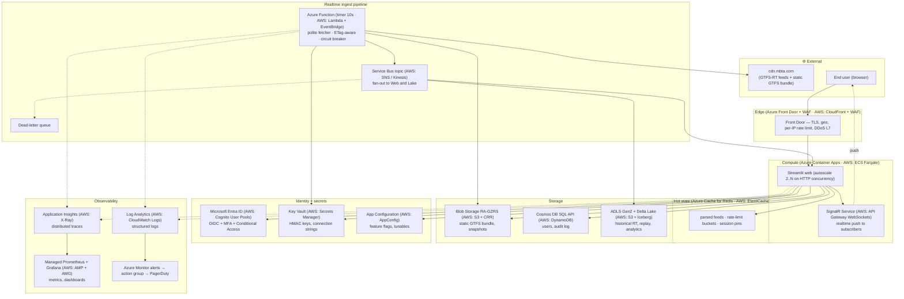

# Azure-prod architecture: detailed comparison

> **Audience.** A reader who knows AWS and wants a thorough walk-through of how this demo's spike-grade architecture would be rebuilt for production on Azure, including the items the demo deliberately defers to the [post-demo backlog](https://github.com/dcltdw/gtfs-demo/issues?q=is%3Aopen+label%3Apost-demo). Every Azure service named has its AWS equivalent in the same row or sentence.
>
> **Companion doc:** [AZURE-PROD-OVERVIEW](AZURE-PROD-OVERVIEW.md) is a 2–3 page version of this comparison covering the demo's current scope only.

## Production target and assumptions

| Dimension | Target | Notes |
|---|---|---|
| **Tenancy** | Single transit agency | Multi-tenant SaaS is a different design and an explicit non-goal. |
| **Traffic** | ~1M daily riders, ~50K peak concurrent web sessions, ~10K WebSocket subscribers at peak | MBTA-scale. Not Netflix-scale; not a corner store either. |
| **Geography** | Single primary Azure region (East US 2) + paired DR region (Central US) | Multi-region active-active deferred — see [Non-goals](#non-goals-and-when-to-revisit). |
| **SLO targets** | Web 99.9% / month available; arrivals data freshness p99 ≤ 30 s; alerts panel freshness p99 ≤ 5 min | Drives the alerting + DR posture below. |
| **Compliance** | None beyond standard public-data hygiene | No HIPAA / PCI / FedRAMP. Adds Confidential Computing + Sovereign Clouds if it ever becomes relevant. |
| **Team size** | 2–4 engineers + on-call | Drives the bias toward managed services over self-hosted. |

The cost target sits in the [Cost order-of-magnitude](#cost-order-of-magnitude) section near the end. There's no specific dollar number — just bands per service line.

## Architecture diagram

## Component map (demo + post-demo backlog)

The table below adds the post-demo backlog (open issues [#15–#41](https://github.com/dcltdw/gtfs-demo/issues?q=is%3Aopen+label%3Apost-demo), plus [#49](https://github.com/dcltdw/gtfs-demo/issues/49) nightly CI and [#57](https://github.com/dcltdw/gtfs-demo/issues/57) credential rotation) to the demo-scope mapping from [AZURE-PROD-OVERVIEW](AZURE-PROD-OVERVIEW.md). Subsections after the table walk through the most consequential changes.

| Concern | Demo today | Prod Azure | AWS equivalent | Backlog issue(s) |
|---|---|---|---|---|
| **Web hosting** | `streamlit run`, single process | **Azure Container Apps** (autoscale, KEDA-driven), or **AKS** if Kubernetes-required | **App Runner** / **ECS Fargate**, or **EKS** | [#17](https://github.com/dcltdw/gtfs-demo/issues/17) (deploy), [#20](https://github.com/dcltdw/gtfs-demo/issues/20) (Docker), [#30](https://github.com/dcltdw/gtfs-demo/issues/30) (k8s/HPA) |
| **Edge / TLS / WAF** | Streamlit's HTTP server | **Front Door** + WAF | **CloudFront** + **WAF** | [#40](https://github.com/dcltdw/gtfs-demo/issues/40) (per-IP rate limit) |
| **Auth — login** | bcrypt + env credential | **Entra ID** (OIDC) | **Cognito User Pools** | [#36](https://github.com/dcltdw/gtfs-demo/issues/36) |
| **Auth — MFA + lockout** | none | **Entra ID Conditional Access** policies | **Cognito MFA** + **WAF** lockout | [#37](https://github.com/dcltdw/gtfs-demo/issues/37) |
| **User accounts (DB-backed)** | one user from `.env` | **Cosmos DB SQL API** (or **Azure SQL DB** for relational) | **DynamoDB** (or **RDS Postgres**) | [#35](https://github.com/dcltdw/gtfs-demo/issues/35) |
| **Audit log** | stdout only | **Cosmos DB** append-only container, _or_ dedicated Log Analytics table with retention policy | **DynamoDB Streams** → **S3** + **Athena** | [#38](https://github.com/dcltdw/gtfs-demo/issues/38) |
| **Session cookie signing** | PyJWT, key in `.env` | Same code; key in **Key Vault**, fetched via Managed Identity | Same; key in **Secrets Manager** via IAM role | — (covered by [#9](https://github.com/dcltdw/gtfs-demo/issues/9) demo-side) |
| **Secrets / config** | `.env` | **App Configuration** + **Key Vault** | **AppConfig** + **Secrets Manager** | [#57](https://github.com/dcltdw/gtfs-demo/issues/57) (rotation) |
| **Realtime feed fetcher** | in-process polling | **Azure Function** (timer 10 s) → **Service Bus** topic | **Lambda** (EventBridge) → **SNS** / **Kinesis** | — (architectural) |
| **Conditional GET on static feed** | none (full re-fetch every 7 d) | Function caches ETag/Last-Modified in **App Configuration**; CDN handles `If-None-Match` | Same pattern; **CloudFront** origin handles ETag | [#16](https://github.com/dcltdw/gtfs-demo/issues/16) |
| **Circuit breaker** | none — `tenacity` retries only | Function uses **Polly**-pattern (or `pybreaker`); Front Door also has origin-health probes | **Step Functions** / `pybreaker` in Lambda | [#22](https://github.com/dcltdw/gtfs-demo/issues/22) |
| **MBTA RT extensions** | not parsed | Same fetch pipeline; parser modules add extension support | Same | [#23](https://github.com/dcltdw/gtfs-demo/issues/23) |
| **GTFS-RT v2 trip mods** | not parsed | Schema-versioned topic messages; consumers branch on version | Same | [#24](https://github.com/dcltdw/gtfs-demo/issues/24) |
| **Data quality assertions** | none | Function emits **DataDog**-style assertions to **Application Insights** custom events; alert on failures | **Glue Data Quality**, or `great_expectations` in Lambda | [#25](https://github.com/dcltdw/gtfs-demo/issues/25) |
| **Static GTFS bundle store** | local 7 d cache | **Blob Storage** (RA-GZRS) + **Azure CDN** | **S3 CRR** + **CloudFront** | — |
| **Snapshot fallback** | committed `examples/*.pb` | Same Blob container + versioning + retention | **S3 Versioning** + lifecycle | — |
| **Parsed-feed cache** | `@st.cache_resource` | **Azure Cache for Redis** (Premium, persistence) | **ElastiCache for Redis** | — |
| **Inbound rate limit** | per-process sliding window | **Front Door** rule (per-IP) + **Redis** counters (per-user) | **WAF** rate-based + **ElastiCache** counters | [#40](https://github.com/dcltdw/gtfs-demo/issues/40), [#41](https://github.com/dcltdw/gtfs-demo/issues/41) (token-bucket ADR) |
| **Realtime push to clients** | none (15 s autorefresh polling) | **SignalR Service** (managed WebSocket); web app pushes per-stop deltas | **API Gateway WebSockets** _or_ **AppSync** subscriptions | [#29](https://github.com/dcltdw/gtfs-demo/issues/29) |
| **Live vehicle map** | none | **Azure Maps** raster/vector tiles + **SignalR**-pushed marker updates | **Amazon Location Service** + **AppSync** | [#15](https://github.com/dcltdw/gtfs-demo/issues/15) |
| **Historical persistence** | none | **ADLS Gen2** + **Delta Lake** tables, written by a Service Bus subscriber | **S3** + **Iceberg** / **Athena** | [#26](https://github.com/dcltdw/gtfs-demo/issues/26) (DuckDB → Delta is a small change) |
| **Delay-distribution dashboard** | none | **Azure Managed Grafana** over Delta tables; or **Power BI** for execs | **Amazon Managed Grafana** + **Athena** / **QuickSight** | [#27](https://github.com/dcltdw/gtfs-demo/issues/27), [#34](https://github.com/dcltdw/gtfs-demo/issues/34) |
| **Anomaly detection (stuck vehicle)** | none | **Stream Analytics** job over the Service Bus topic, or **Anomaly Detector** REST API | **Kinesis Data Analytics** / **Lookout for Metrics** | [#28](https://github.com/dcltdw/gtfs-demo/issues/28) |
| **Logging** | stdlib → stdout | **Log Analytics** workspace; KQL queries; retention policy per data class | **CloudWatch Logs** + **Logs Insights** | — |
| **Tracing** | none | **Application Insights** with **OpenTelemetry** auto-instrumentation | **AWS X-Ray** + **OpenTelemetry** | [#31](https://github.com/dcltdw/gtfs-demo/issues/31) |
| **Metrics — app-emitted** | none | **Azure Monitor managed Prometheus** scrapes the web app's `/metrics` | **AWS Managed Prometheus** | [#33](https://github.com/dcltdw/gtfs-demo/issues/33) |
| **Metrics — platform** | none | Built-in for ACA, Service Bus, Redis, Front Door | Built-in for ECS, SNS, ElastiCache, CloudFront | — |
| **Health probe** | none | ACA liveness + readiness probes hit `/health`; Front Door origin-health probe | ECS health check + ALB health check | [#21](https://github.com/dcltdw/gtfs-demo/issues/21) |
| **Coverage reporting** | local only | **Codecov** + **GitHub Actions** (works on Azure as well) | Same | [#18](https://github.com/dcltdw/gtfs-demo/issues/18) |
| **Mutation testing** | none | `mutmut` step in CI | Same | [#19](https://github.com/dcltdw/gtfs-demo/issues/19) |
| **Performance benchmark** | none | **Azure Load Testing** service | **AWS Distributed Load Testing** solution | [#32](https://github.com/dcltdw/gtfs-demo/issues/32) |
| **Vuln scanning** | none | `pip-audit` in CI + **Microsoft Defender for Cloud** for runtime | `pip-audit` + **Inspector** | [#39](https://github.com/dcltdw/gtfs-demo/issues/39) |
| **Static site (notebook + docs)** | GitHub Pages | **Azure Static Web Apps** | **S3 + CloudFront** / **Amplify Hosting** | — |
| **CI** | GitHub Actions | Same, _or_ **Azure DevOps Pipelines** | Same, _or_ **CodePipeline** + **CodeBuild** | — |
| **Live-feed regression CI** | none | Scheduled GitHub Actions / ADO pipeline running `pytest -m live` against staging | Same | [#49](https://github.com/dcltdw/gtfs-demo/issues/49) |
| **Deploy / IaC** | manual | **Bicep** (preferred) or **Terraform** → ACA revisions; blue-green via revision traffic split | **AWS CDK** / **Terraform** → ECS rolling, **CodeDeploy** blue-green | — |
| **DR** | none | Paired Azure region; Blob RA-GZRS; Key Vault soft-delete + replication; Front Door priority-routed failover | **S3 CRR**; **Secrets Manager** replicas; **Route 53** health-check failover | — |

## Per-component deep-dives

The table is dense. Here are the seven components where the demo → prod gap is the most consequential.

### 1. Compute and hosting

**Choice:** Azure Container Apps (ACA), with AKS as a fallback. AWS analogues: App Runner / ECS Fargate, with EKS as fallback.

**Why ACA, not AKS by default.** ACA is the managed-Kubernetes-with-the-knobs-hidden tier. You bring a container image; ACA runs it across a serverless pool, scales it on HTTP concurrency or KEDA-bound external metrics (Service Bus depth, Redis queue length), and gives you revision-based blue-green via traffic split. There's no node fleet to patch, no etcd to back up, no networking to understand beyond a VNet integration. For a 2–4 engineer team running a single workload, that's the right cost-of-ownership tier. AKS (and EKS on AWS) makes sense once you've got a fleet of services with shared sidecars, custom CRDs, or a platform team who already operates Kubernetes — see [#30](https://github.com/dcltdw/gtfs-demo/issues/30).

**What changes vs. the demo.** Streamlit binds to `0.0.0.0:8501` inside the container (no other change to the app code). The container ships with `uv sync` baked in — same `pyproject.toml`, same lockfile. ACA's revision system replaces "stop and restart" with "deploy a new revision and shift 10% of traffic"; the demo's [Operational impact](AI-COLLABORATION-CONVENTIONS.md#4e-surface-operational-impact-restart--rebuild--migration-needs) notes that say "restart `just demo`" become "ship a new revision."

**Streamlit specifically.** Streamlit's session state is per-pod by default. Two design responses, both used together:

1. **Pin a session to one pod** via Front Door's session-affinity cookie (AWS: ALB sticky sessions). Cheap; required because Streamlit's `st.session_state` is in-process.
2. **Externalise anything load-bearing** — auth state, last-rendered arrivals snapshot, rate-limit buckets — to Redis or Cosmos DB. The demo's `st.session_state["last_arrivals"]` becomes a small Redis read. Reconnect-after-pod-eviction works because the next pod can rehydrate from Redis.

### 2. Auth and identity

**Choice:** Entra ID (formerly Azure AD) for OIDC, with Conditional Access for MFA. AWS analogue: Cognito User Pools + IAM Identity Center for staff.

**Why ditch the bcrypt-in-env approach.** The demo's posture is honest: one credential, rotated each demo cycle, documented in [SECURITY.md](SECURITY.md). At production scale that becomes a liability — there's no per-user audit, no MFA, no session revocation, and the rotation policy is "operator changes the env-var and restarts." Entra ID gives you OIDC sign-in, MFA via the Authenticator app or FIDO2, conditional access policies (e.g., "block sign-ins from outside the agency's geo unless the user has a registered device"), and per-user audit trails that flow into Log Analytics.

**Identity for service-to-service calls.** The web app fetches the cookie HMAC key from Key Vault; the Function fetches MBTA URLs from App Configuration; both write to Service Bus and Redis. None of those calls carry a static secret in production. Each Azure resource gets a **Managed Identity** (AWS: an IAM role attached to the compute) and the resources being called grant access to that identity by RBAC. The .env-file pattern goes away entirely for secrets — App Configuration + Key Vault hold the equivalent values, and the workload reads them via the Azure SDK at startup.

**Audit log ([#38](https://github.com/dcltdw/gtfs-demo/issues/38)).** The demo's `auth.login.success` / `auth.login.failure` events go to stdout. In prod they go to a dedicated Log Analytics table (or a Cosmos DB append-only container if you want sub-second query latency on the audit trail). KQL queries answer "show me every failed login from a non-corporate IP in the last 24 h" cheaply.

### 3. The realtime ingest pipeline

This is the **single biggest architectural change** from the demo. The demo's web app polls MBTA itself; prod splits ingest into a dedicated Function and a topic.

**Why the split matters.**

- **Outbound politeness is now globally enforced.** Every web instance polled MBTA in the demo. Two instances = 2× the outbound traffic, and the in-process limiter can't see other instances' fetches. One Function with a singleton timer trigger gives you exactly one fetch per 10 s per feed regardless of how the web tier scales.
- **Web restarts don't lose recent data.** The Function writes the latest parsed payload to Redis on each tick. A web pod that restarts pulls the most recent payload from Redis and is current within ~10 s, instead of cold-starting an MBTA fetch.
- **Feed snapshots become a side effect, not a special path.** A second Service Bus subscriber (a small "Lake writer" Function) appends every payload to ADLS Gen2 in Delta format. That gives you the [DuckDB persistence](https://github.com/dcltdw/gtfs-demo/issues/26) and [delay-distribution dashboard](https://github.com/dcltdw/gtfs-demo/issues/27) for free — no extra fetches.

**ETag-aware fetching ([#16](https://github.com/dcltdw/gtfs-demo/issues/16)).** Static GTFS rarely changes. The Function caches the last `ETag` / `Last-Modified` in App Configuration; on each weekly check it sends `If-None-Match` and gets a 304 most weeks. AWS shape: identical, with the cache in DynamoDB or Parameter Store.

**Circuit breaker ([#22](https://github.com/dcltdw/gtfs-demo/issues/22)).** When MBTA is degraded, `tenacity` retries fast and gives up. In prod the Function wraps fetches with a `pybreaker` circuit; on opening, it stops fetching for 60 s and emits a `feed.fetcher.circuit_open` metric that pages the on-call. Front Door's origin-health probe is a separate but complementary signal — it detects when *our* edge is unhealthy.

**Schema versioning ([#24](https://github.com/dcltdw/gtfs-demo/issues/24)).** Service Bus messages carry a `schemaVersion` property. When MBTA upgrades to GTFS-RT v2 trip modifications, the Function emits two messages — v1 for the existing web subscriber, v2 for a new "trip-mods" subscriber — until every consumer has migrated. The bus is the seam where versioning lives.

### 4. Hot state and persistence

**Hot state: Azure Cache for Redis (AWS: ElastiCache for Redis).** Premium tier with persistence (RDB snapshots) and zone-redundancy. Two roles:

- **Parsed-feed cache.** The Function writes the most recent `(feed_type, parsed_payload)` blob on each tick; web instances read on every render. Replaces the demo's `@st.cache_resource`. Sized for the parsed payload (~100 KB per feed, three feeds, comfortably 1 MB total — Premium's smallest SKU is overkill).
- **Inbound rate-limit buckets.** Replaces the demo's per-process [`SessionRateLimiter`](../gtfs_demo/security/rate_limit.py). One Redis sorted-set per `(user_id_or_ip, window)`; `ZREMRANGEBYSCORE` evicts old entries. Per-IP buckets are also enforced at the edge by Front Door, so Redis only sees traffic that already passed L7. The token-bucket-vs-sliding-window ADR ([#41](https://github.com/dcltdw/gtfs-demo/issues/41)) is unaffected: Redis can implement either.

**User accounts: Cosmos DB SQL API (AWS: DynamoDB).** One container per concern (`users`, `sessions`, `audit`). Cosmos's per-document RU billing maps cleanly to DynamoDB's RCU/WCU model; partition-key choice matters for both. For [#35](https://github.com/dcltdw/gtfs-demo/issues/35) (real DB-backed users), the partition key is `user_id`; for [#38](https://github.com/dcltdw/gtfs-demo/issues/38) (audit log), the partition key is `(date, user_id)` so a "show me today's audit trail for user X" query lands in one partition.

**Cold storage / lakehouse: ADLS Gen2 + Delta Lake (AWS: S3 + Iceberg / Athena).** Append-only landing zone for every parsed feed payload. Delta gives you ACID + time-travel + schema evolution; the underlying storage is just blobs. Read with **Synapse Serverless SQL** (AWS: **Athena**) for ad-hoc queries, or **Databricks** / **Fabric** (AWS: **EMR** / **Glue**) for jobs. The [delay-distribution dashboard](https://github.com/dcltdw/gtfs-demo/issues/27) is a Grafana panel over a Delta SQL view.

### 5. Observability

**Logs: Application Insights → Log Analytics (AWS: CloudWatch Logs + Logs Insights).** OpenTelemetry instrumentation is built into the Azure SDK; structured logs from `logger.info` flow into the same workspace as platform logs. KQL queries replace `grep`. Retention policy splits hot (30 d, queryable) from cold (1 y, archive) per cost class.

**Traces: Application Insights (AWS: X-Ray).** OTel auto-instruments `requests`, `redis`, `azure.servicebus`, and the ASGI / WSGI surface. A single trace shows: user request → Front Door → ACA pod → Redis read → Streamlit render. The Function's fetch shows up as a separate trace; correlated via the GTFS-RT message `id` carried as a span attribute.

**Metrics: Managed Prometheus + Managed Grafana (AWS: AMP + AMG).** App-emitted Prometheus metrics from a `/metrics` endpoint ([#33](https://github.com/dcltdw/gtfs-demo/issues/33)) plus platform metrics (ACA replica count, Service Bus depth, Redis hit ratio). Grafana dashboards: one for SLO compliance, one per service tier.

**Alerts: Azure Monitor → Action Group → PagerDuty.** Pageable rules:

- Arrivals data freshness p99 > 30 s for 5 min.
- Service Bus DLQ depth > 0.
- Web 5xx ratio > 1% for 5 min.
- Function failure rate > 5% for 5 min.
- Front Door origin health < 50% for 1 min.

The demo's `should_show_stale_banner` lives on as the user-facing signal; the alerts above are the on-call signal that fires before users see the banner.

### 6. Networking and edge

**Front Door (AWS: CloudFront).** TLS termination, geo-routing if the demo ever leaves a single region, per-IP rate limit (built-in WAF rule), DDoS L7 protection. Origin is the ACA environment's public ingress; session-affinity cookie pins a user to one pod.

**WAF policy.** OWASP Core Rule Set + custom rules. Rate-limit thresholds tuned per route (`/api/*` tighter than `/static/*`). Bot-protection at the edge for the public Streamlit endpoints; corporate routes (admin dashboard if it ever exists) require Entra ID.

**Private networking.** ACA, Function, Cosmos, Redis, Storage all peer into one VNet via Private Endpoints (AWS: VPC Endpoints / PrivateLink). Public ingress is only on Front Door; everything else has no public IP.

### 7. CI/CD, IaC, and release

**IaC: Bicep (AWS: CDK).** Bicep compiles to ARM templates and is the path of least friction on Azure; Terraform also works and is the right pick if you've got a multi-cloud estate. CDK is the AWS-native equivalent.

**CI: GitHub Actions (no change required).** The demo's [NF-012 CI pipeline](agent-spec/NF-012-ci-pipeline.md) keeps working — `ruff` + `mypy` + `pytest -m 'not live'` on every PR. Two prod-only additions:

- **Container build + scan.** GitHub Actions builds the image, runs `docker scout` or **Microsoft Defender for Cloud** vuln scan (AWS: **Inspector**), pushes to **Azure Container Registry** (AWS: **ECR**) on green.
- **Bicep what-if** before apply, on every PR that touches `infra/`. Comments the diff into the PR.

**Release: blue-green via ACA revisions.** Bicep stamps a new revision; the deploy job sets the traffic split to 10% new / 90% old; SLO dashboards watch for regressions; auto-promote to 100% after a soak window, or auto-rollback on the first SLO breach. AWS analogue: **CodeDeploy** blue-green for ECS, with the same SLO-based auto-promote.

**Live-feed regression CI ([#49](https://github.com/dcltdw/gtfs-demo/issues/49)).** Nightly scheduled job runs `pytest -m live` against the staging Function tier — catches MBTA schema changes before they hit prod.

**Credential rotation ([#57](https://github.com/dcltdw/gtfs-demo/issues/57)).** Key Vault rotation policies handle most secrets natively. The demo password rotation runbook becomes a small Function triggered on a Key Vault event: rotate, hash, push the new bcrypt hash to App Configuration, broadcast a `force-logout` event over Service Bus.

## Cost order-of-magnitude

Rough monthly bands at the production target traffic (~1M daily riders, ~50K peak concurrent web sessions, ~10K WebSocket subscribers). Numbers are within a factor of 2 — meant to compare service categories, not to be a budget.

| Category | Band | Drivers |
|---|---|---|
| **Compute (ACA web)** | $200–$600 / mo | 4–10 always-on cores; KEDA scales to zero overnight if traffic permits |
| **Compute (Function fetcher)** | $20–$80 / mo | ~260K invocations/mo (10s × 3 feeds × 30 d); free-tier-friendly |
| **Edge (Front Door + WAF)** | $250–$500 / mo | Front Door Standard/Premium base + WAF policy + egress |
| **Hot state (Redis Premium)** | $300–$800 / mo | Smallest Premium SKU + zone-redundancy; sized for ~50K active sessions |
| **Storage (Blob + ADLS)** | $30–$150 / mo | Static GTFS bundle is tiny; ADLS lake grows over time |
| **OLAP / queries (Synapse Serverless)** | $50–$300 / mo | Pay-per-query; depends on dashboard refresh cadence |
| **Database (Cosmos DB)** | $100–$400 / mo | Provisioned-throughput RU/s; small for 10K active users |
| **Identity (Entra ID)** | $0–$200 / mo | Entra free tier covers basic OIDC; P1 needed for Conditional Access |
| **Observability (App Insights + Log Analytics + Managed Grafana)** | $200–$700 / mo | Logs are the biggest variable; sample tracing in prod, full-fidelity in staging |
| **Service Bus** | $50–$150 / mo | Standard tier; Premium only if you need VNet integration on the bus itself |
| **SignalR Service** | $100–$400 / mo | Standard SKU + concurrent connection units sized for ~10K WebSocket subscribers |
| **Total ballpark** | **$1,300–$4,300 / mo** | Below $2K with frugal sizing; above $4K once you turn on every nice-to-have |

AWS-equivalent totals come out within ~20% of these bands at this scale; the dominant variables (egress, log retention, Premium-SKU minimums) are similar across both clouds. Big deltas only appear at the extremes — sub-$100/mo (where AWS's Lambda free tier dominates) and multi-$10K/mo (where reserved-instance discounts diverge).

## Non-goals and when to revisit

| Non-goal | When to add it |
|---|---|
| **Multi-region active-active** | When the SLO commitment crosses 99.95% / month, _or_ a regulatory requirement mandates dual-region. Adds Front Door priority-set, active-active Cosmos (multi-write), Service Bus geo-DR, and a tested traffic split. The single-region + DR posture above survives a region outage with documented RPO/RTO; active-active eliminates the failover window at substantially higher steady-state cost. |
| **Multi-tenant SaaS (multiple agencies)** | When the second customer signs. Different design: per-tenant data partitions, federated identity (Entra ID External Identities or B2C; AWS: Cognito Identity Pools), per-tenant config, tenant-aware billing. |
| **Real-time streaming to mobile apps** | When a native mobile client ships. SignalR covers browsers cleanly; mobile-friendly transports (Server-Sent Events, MQTT) are layered on. |
| **Self-hosted Kubernetes (AKS/EKS)** | When the workload count outgrows ACA's per-app model, or the team wants custom CRDs / sidecars / a service mesh. The migration from ACA → AKS is a re-host, not a re-architect. |
| **Federated identity for government partners** | When a government partner needs SAML or OIDC federation. Entra ID handles this natively; called out here so it doesn't surprise the team later. |

## Where to read next

- [AZURE-PROD-OVERVIEW](AZURE-PROD-OVERVIEW.md) — the 2–3 page version of this doc, demo scope only.
- [README — Architecture](../README.md#architecture) — the demo's data path, with mermaid diagram.
- [UPGRADE-PATH](UPGRADE-PATH.md) — what changes when moving off MBTA's strict GTFS-RT to the V3 REST API. Orthogonal to this doc.
- [SECURITY](SECURITY.md) — current threat model and rotation policy.
- [Post-demo backlog](https://github.com/dcltdw/gtfs-demo/issues?q=is%3Aopen+label%3Apost-demo) — the open issues this doc folds into the prod design.
